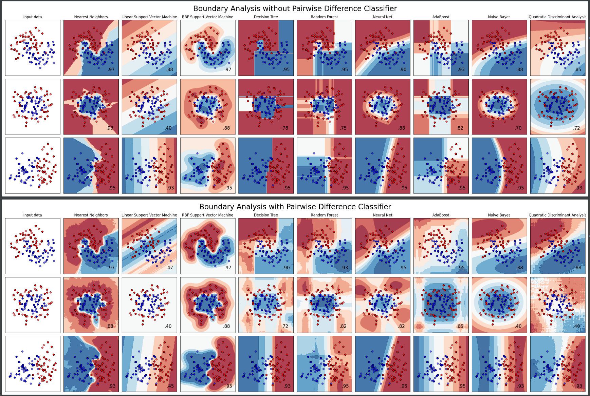

# Pairwise difference learning (pl)
**Pairwise Difference Learning** (PDL) library is a python module. It contains a scikit-learn compatible implementation of PDL Classifier, as described in (todo add arxiv). 

**PDL Classifier** or PDC is a meta learner that can reduce multiclass classification problem into a binary classification problem (similar/different).

[//]: # (**PDL Regressor** or PDR is a meta learner that solves regression problem by learning the difference.)

## Installation
To install the package, run the following command:
```shell
pip install -U pl
```

[comment]: <> (todo conda link)

## Usage
```python
from pl import PairwiseDifferenceClassifier

from sklearn.ensemble import RandomForestClassifier
from sklearn.datasets import make_blobs

# Generate random data with 2 features, 10 points, and 3 classes
X, y = make_blobs(n_samples=10, n_features=2, centers=3, random_state=0)

pdc = PairwiseDifferenceClassifier(estimator=RandomForestClassifier())
pdc.fit(X, y)
print('score:', pdc.score(X, y))

y_pred = pdc.predict(X)
proba_pred = pdc.predict_proba(X)
```
Please consult `examples/` directory for more examples.


## How does it work?
The PDL algorithm works by transforming the multiclass classification problem into a binary classification problem. The algorithm works as follows:


## Evaluation
To reproduce the experiment of the paper, please run `run_benchmark.py` with a base learner and a dataset number, between 0 and 99. Example:

`python run_benchmark.py --model DecisionTreeClassifier --data 0`

scores will be stored in `./results/tmp/` directory.


### Score comparison


### 2D datasets Examples



## Reference
Please cite the following paper if you use this library in your research:
```
% The first commit correspond to the original implementation of the PDC algorithm

todo
```
